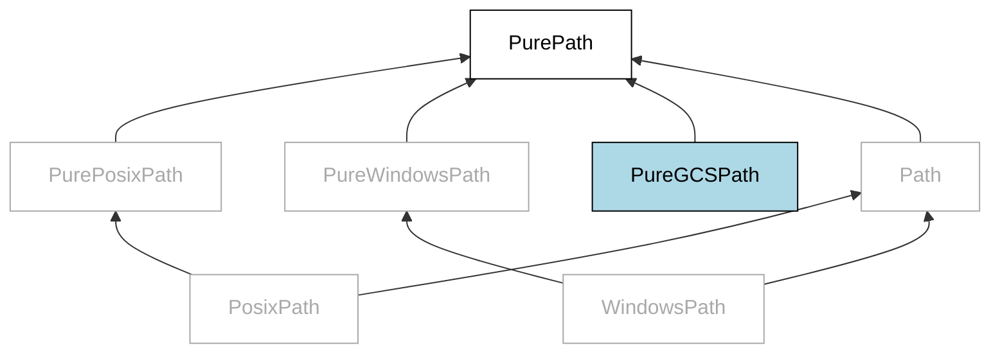

# gcspathlib

`pathlib`-like manipulation of Cloud Storage URIs



## Overview

`gcspathlib` brings the familiarity of the standard `pathlib` library to Google Cloud Storage (GCS) URI manipulation by providing a GCS-flavored implementation of `pathlib.PurePath`.

While other libraries exist that offer GCS path manipulation, they are much too heavy, reinventing the kitchen sink with involuntarily blocking I/O - even for basic path manipulation (shockingly). Unlike such libraries, `gcspathlib` is a lightweight and simple alternative that's fully compatible with the standard `pathlib` interface.

This simple, yet powerful design allows developers to easily handle Cloud Storage URIs without the need to learn a new library. By leveraging the familiar `pathlib` interface, `gcspathlib` provides standard path manipulation with GCS-specific features, such as converting to/from `gs://` URIs and manipulating bucket/object names independently.

### Quickstart

**Construct from URI:**

```python
>>> path = gcspathlib.PureGCSPath('gs://meowmixer/static/tuna.bin')
>>> (path.bucket, path.obj)
('meowmixer', 'static/tuna.bin')
```

**Construct relative path:**

```python
>>> rel_path = PureGCSPath('images/cats') / 'meow37.png'
>>> rel_path
PureGCSPath('images/cats/meow37.png')
```

**Assign bucket:**

```python
>>> abs_path = rel_path.with_bucket('meowmixer')
>>> abs_path
PureGCSPath('gs://images/cats/meow37.png')
```

**Convert to URI:**

```python
>>> abs_path.as_uri()
'gs://images/cats/meow37.png'
```

### Features

`gcspathlib` provides all the basic functionality of `pathlib.PurePath`:

* path joining and splitting
* file extension manipulation
* parent directory traversal
* handling of both relative and absolute paths
* separator (`/`) normalization
* hashability and immutability

`gcspathlib` provides additional features specific to GCS

* conversion to/from `gs://` URIs
* independent manipulation of GCS bucket and object names

## Usage

(TODO)

## Frequently Asked Questions

**Why `PureGCSPath('gs://bucket/obj')` and not `PureGCSPath('bucket/obj')`?**

`PureGCSPath('bucket/obj')` would be a bucketless, relative path. The `gs://bucket/` prefix serves a role analogous to the `'C:\\'` in ``PureWindowsPath('C:\\file')`` - and in fact is represented as the `.drive` property of the path object, similarly to ordinary handling of a Windows drive and operating within the bounds of `pathlib`'s standard logic.

**Why not just use `pathlib.PurePosixPath` and `urllib.parse`?**

It's certainly possible to use `PurePosixPath` for manipulating GCS *object* names. However, passing multiple `(bucket, obj)` parameters around is cumbersome; and converting to/from GCS URIs is tedious, noisy, and redundant. It results in constant, needlessly exhausting dilemmas of whether to pass `(bucket, obj)` tuples vs URIs vs mere object names, how to name each `bucket` and `obj` variable to make it clear that they're related, how to use the right `urllib.parse` function to decode the URI with proper un-escaping, whether to use a named constant for the `gs://{bucket}/{obj}` string format or to embed it inline, how to format GCS paths for logging - on and on. The overhead compounds on itself, especially in larger applications - which often reinvent a "GCS utils" module in a non-standardized way.

`gcspathlib` streamlines all this. It offers a simple method to convert to/from GCS URIs, and effortlessly allows the retrieval or manipulation of the bucket and/or object names. A single `gcspathlib.PureGCSPath` object can encapsulate the entire GCS path, eliminating the need to pass around multiple strings.

## Disclaimer

This library is currently in an experimental/alpha state and subject to breaking changes - YMMV.
